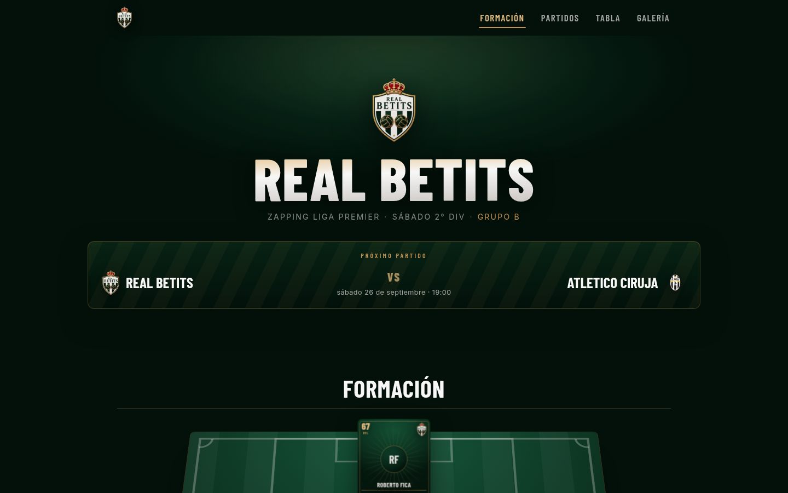
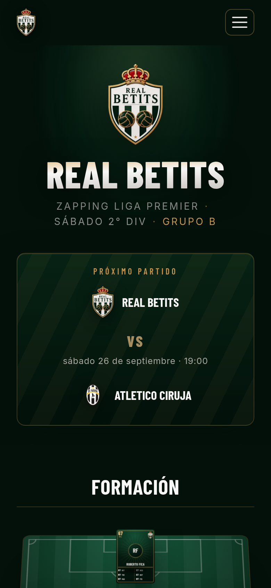
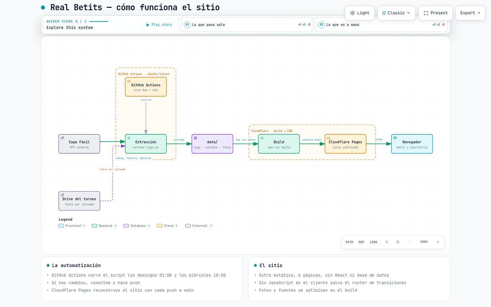

# Real Betits 🟢⚪

Sitio del equipo **Real Betits** — parodia cariñosa del Real Betis — que juega en la
**Zapping Liga Premier · Sábado 2° DIV · Grupo B**, organizada por
[Liga Premier](https://copafacil.com/ligapremier-zapping) y gestionada en Copa Fácil.

**[→ Verlo en vivo: real-betits.pages.dev](https://real-betits.pages.dev/)**

<table>
<tr>
<td width="70%"></td>
<td width="30%"></td>
</tr>
<tr>
<td align="center"><sub>Escritorio · 1440 px</sub></td>
<td align="center"><sub>Móvil · 390 px</sub></td>
</tr>
</table>

## Qué trae

| ruta | qué muestra |
|---|---|
| `/` | Home: el escudo, el próximo partido y el equipo titular en la cancha (1-2-3-1), más la banca |
| `/partidos` | El ticket del próximo partido, cómo va la campaña y el detalle jornada a jornada |
| `/tabla` | Posiciones de los dos grupos y la tabla de goleadores |
| `/galeria` | Las fotos de cada fecha jugada, con visor a pantalla completa |
| `/estilo` | Guía de estilo: la paleta y las cartas de jugador aisladas |

La última es una página de trabajo, no de contenido.

## Stack y decisiones

- **Astro 7** con `output: 'static'`. Es HTML plano: no hay servidor, ni base de datos, ni rutas dinámicas.
- **Sin React ni islas de framework.** Lo único que corre en el navegador es el `ClientRouter`
  (el fade entre páginas) y el visor de la galería.
- **Los datos van versionados en git.** Si la liga cambia, el sitio cambia con un commit y queda el historial.
- **Deploy en Cloudflare Pages**, sirviendo en la raíz del dominio. Se descartó GitHub Pages a
  propósito: ahí el sitio habría quedado en `/real-betits/` y todos los assets necesitarían prefijo.

## Cómo funciona el sistema

<picture>
  <source media="(prefers-color-scheme: dark)" srcset="docs/diagramas/real-betits-arquitectura.png">
  <source media="(prefers-color-scheme: light)" srcset="docs/diagramas/real-betits-arquitectura-claro.png">
  
</picture>

<sub>Diagrama generado con [Archify](https://github.com/tt-a1i/archify) · fuente: [`docs/diagramas/real-betits.architecture.json`](docs/diagramas/real-betits.architecture.json) · **[abrir el mapa interactivo →](https://real-betits.pages.dev/diagrama/)**</sub>

La cadena, paso a paso:

1. **GitHub Actions** ejecuta `scripts/extraer-liga.py` los domingos a la 01:00 y los miércoles
   a las 10:00 (hora de Chile). El del domingo es el chequeo importante: los partidos son todos
   sábado por la tarde, así que los resultados se publican esa noche.
2. El script consulta la **API interna de Copa Fácil** y lista el **Drive del torneo**, y con eso
   reescribe `data/liga.json`, baja los escudos de los rivales y las fotos de la jornada.
3. Si la descarga falla o los datos salen incoherentes, **el script termina con código ≠ 0 y no
   commitea nada**: el sitio se queda con el último dato bueno en vez de publicar basura.
4. Si hay cambios, commitea como `data: actualizar liga (fecha)` y hace push.
5. Ese push hace que **Cloudflare Pages reconstruya el sitio** (`npm run build`) y lo publique.

## Mapa del repo

| ruta | qué es | origen |
|---|---|---|
| `data/liga.json` | Tabla, fixture y galería de la división | **automático** |
| `data/logos/` | Escudos de los equipos de la división | **automático** |
| `data/galeria/fecha-N/` | Las 12 fotos de cada jornada, bajadas del Drive | **automático** |
| `data/galeria/fecha-N.jpg` | La portada que publica la app de la liga (fondo del camino) | **automático** |
| `data/galeria-carpetas.json` | Mapa fecha → carpeta del Drive | **a mano** |
| `src/data/plantilla.json` | Plantilla, posiciones y dorsales | **a mano** |
| `src/lib/` | Helpers de liga, plantilla, galería y escudos | código |
| `src/components/` | Los 13 componentes `.astro` del sitio | código |
| `src/layouts/` | `Base` (el `<head>`) y `Sitio` (navbar + footer) | código |
| `src/pages/` | Las 6 rutas, más la página 404 | código |
| `src/styles/` | `global.css` (tokens, secciones) y `fuentes.css` (`@font-face`) | código |
| `src/assets/` | El escudo: PNG fuente y el WebP que se sirve | assets |
| `public/` | Fuentes `.woff2` subseteadas, favicon, `robots.txt`, `_headers` y el diagrama interactivo | assets |
| `scripts/` | Extracción de la liga y subseteo de fuentes | herramientas |
| `.github/workflows/` | El Action del cron | automatización |
| `docs/` | Capturas y el render del diagrama (PNG + fuente) | documentación |

**Regla:** lo que está en `data/` lo escribe el script. Si editas algo de ahí a mano, el próximo
domingo se pierde.

## Cómo correrlo

```bash
npm install
npm run dev        # http://localhost:4321
npm run build      # genera dist/
npm run preview    # sirve dist/ para revisarlo como en producción
```

Requiere **Node ≥ 22** (el repo trae `.nvmrc`).

Python se usa solo para los dos scripts: `scripts/extraer-liga.py` funciona únicamente con la
librería estándar; `scripts/subsetear-fuentes.py` necesita `fonttools` y `brotli` en un venv
aparte (las instrucciones están en la cabecera del propio archivo).

## De dónde salen los datos

La web de Copa Fácil es una app **Flutter Web** (canvas), así que su HTML no dice nada. Los datos
se obtienen de su API interna, que es pública y sin login:

| qué | endpoint |
|---|---|
| Info del torneo | `https://copafacil.com/request/event?id=-hdryi` |
| Partidos | `https://copafacil-web.firebaseio.com/events/-hdryi/matchs.json` |
| Galería | `https://copafacil-web.firebaseio.com/events/-hdryi/midia.json` |
| Escudos | `https://copafacil-storage.b-cdn.net/events%2F-hdryi%2Fx7miv%2Fteams%2F<id>.png` |
| Fotos | `https://drive.google.com/embeddedfolderview?id=<carpeta>#list` |

> ⚠️ Es una API **no oficial ni documentada**. Puede cambiar sin aviso.

**Lo que sí es a mano:**

- **El turno de la cancha.** Las fotos se publican por turno (`TURNO n CANCHA 4`) y el horario no
  alcanza para deducir cuál fue el nuestro, así que la carpeta se anota en
  `data/galeria-carpetas.json`.
- **La plantilla.** `src/data/plantilla.json` se mantiene a mano porque la ruta de inscripción del
  sitio de la liga está protegida.

## La liga

- **Torneo**: Zapping Liga Premier · Torneos Clausura
- **División**: Sábado 2° DIV Zapping (12 equipos, 2 grupos de 6)
- **Grupo de Real Betits**: B
- **Fechas**: 05/09/2026 → 28/11/2026

## Deploy

El sitio vive en **Cloudflare Pages**, conectado a este repo:

| ajuste | valor |
|---|---|
| Branch de producción | `main` |
| Build command | `npm run build` |
| Output directory | `dist` |
| Variable de entorno | `NODE_VERSION = 22` |

Un push a `main` — tuyo o del Action — dispara un build nuevo.

## Rendimiento

Medido el 24 de septiembre de 2026 con Lighthouse (4G simulado y CPU 4× más lenta) sobre el sitio
publicado:

| | Home | Galería |
|---|---|---|
| Rendimiento | **100 / 100** | 99 / 100 |
| First Contentful Paint | 0,9 s | 0,9 s |
| Largest Contentful Paint | 1,4 s | 2,1 s |
| Total Blocking Time | **0 ms** | 0 ms |
| Speed Index | 0,9 s | **0,9 s** |
| Peso de la primera visita | **94 KB** | 443 KB |

Está optimizado para móvil, no solo adaptado: el home pesa 94 KB, la galería muestra una foto
grande por álbum en vez de 12 miniaturas de 140 px donde no se distinguía nada, y el menú se cierra
antes de navegar. Ninguna de las dos versiones descarga JavaScript de framework.

## Créditos y avisos

- **Las fotos son de la fotografía oficial de la liga**, publicadas en el Drive del torneo. El sitio
  muestra una selección de cada fecha y enlaza al álbum completo, que es donde están todas y en
  tamaño grande.
- **El código va con licencia MIT** (ver [`LICENSE`](LICENSE)): se puede copiar, modificar y reusar.
  Lo que la licencia **no** cubre son las fotos, el escudo ni los datos: eso es de la liga y de los
  equipos.
- **Los datos y los escudos pertenecen a Copa Fácil** y a los equipos de la división. Este repo solo
  los muestra.
- **Esto es una parodia y no tiene ninguna relación con el Real Betis Balompié.** El nombre
  "REAL BETITS" está escrito así a propósito.

